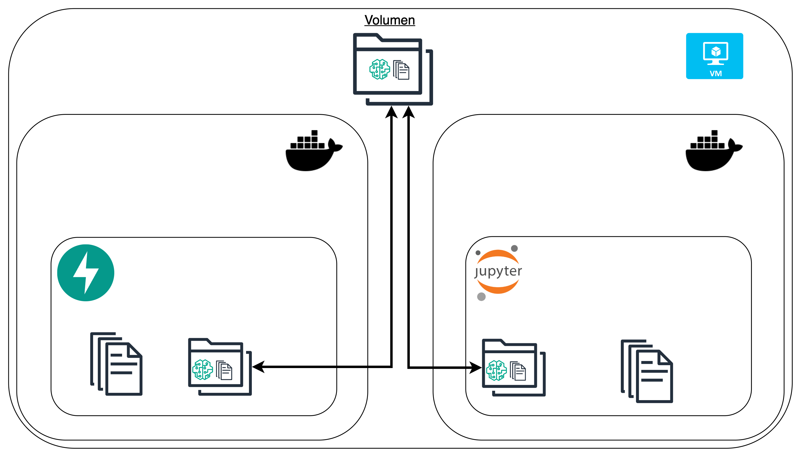

# Desarrollo en contenedores
Desarrollar en contenedores ofrece ventajas significativas al proporcionar aislamiento de entornos, lo que evita conflictos de dependencias entre proyectos y garantiza que las aplicaciones se ejecuten de manera consistente en diferentes sistemas. Además, facilita la portabilidad, permitiendo que el mismo contenedor funcione sin modificaciones en cualquier entorno, ya sea local, en servidores o en la nube. Los contenedores también mejoran la escalabilidad y simplifican los flujos de trabajo de integración y despliegue continuo (CI/CD), optimizando la gestión de recursos y el mantenimiento del software.

Implementar JupyterLab en un contenedor maximiza estos beneficios al crear un entorno de desarrollo aislado, reproducible y fácil de desplegar. Esto permite experimentar con diferentes bibliotecas y versiones sin afectar el sistema principal, facilita la colaboración en equipos de ciencia de datos y simplifica la configuración de entornos complejos. Además, es ideal para entornos en la nube, ya que permite escalar instancias de JupyterLab según la demanda, manteniendo la flexibilidad y la eficiencia operativa.

### Ventajas y Desventajas de UV y Docker en Ciencia de Datos y MLOps

En el ámbito de la ciencia de datos y MLOps, el uso de contenedores mediante Docker se ha consolidado como una práctica fundamental para unificar dependencias y reducir la fricción en los despliegues. Por otro lado, manejadores de dependencias como UV buscan mantener la cohesión en el desarrollo de aplicaciones, especialmente en entornos basados en Python. Ambos enfoques presentan ventajas y desventajas que conviene analizar para determinar su idoneidad en distintos contextos.

Docker ofrece una serie de ventajas notables. Su principal fortaleza radica en la portabilidad, ya que permite ejecutar aplicaciones de manera consistente en cualquier entorno, sea local, en servidores o en la nube. Además, proporciona un alto nivel de aislamiento, dado que cada contenedor incluye su propio sistema de archivos y conjunto de dependencias, lo que elimina conflictos entre proyectos. Otra ventaja significativa es su capacidad de escalar aplicaciones de forma eficiente, gracias a su integración nativa con Kubernetes y otros orquestadores. Esta capacidad de escalado se complementa con la reproducibilidad que ofrece, aspecto crucial en ciencia de datos, donde la replicación de experimentos es fundamental. Finalmente, Docker simplifica el despliegue continuo al integrarse fácilmente con flujos CI/CD, lo que facilita la automatización de la puesta en producción de modelos.

Sin embargo, Docker también tiene desventajas. Aunque es más ligero que una máquina virtual, introduce cierta sobrecarga en el uso de CPU y memoria. Su uso puede resultar complejo, especialmente para quienes deben aprender a manejar Dockerfiles, redes, volúmenes y configuraciones de orquestación. Además, si no se gestionan adecuadamente las imágenes y configuraciones, pueden surgir problemas de seguridad debido a vulnerabilidades en el software empaquetado.

Por su parte, UV se destaca como un manejador de dependencias extremadamente rápido para la resolución e instalación de paquetes en comparación con herramientas tradicionales como pip o pipenv. UV mejora la consistencia en la gestión de dependencias, asegurando que las versiones utilizadas sean uniformes en diferentes entornos de desarrollo. Al ser una herramienta ligera, resulta ideal para la gestión de entornos de desarrollo locales sin necesidad de depender de contenedores. Sin embargo, UV presenta algunas limitaciones. Su ámbito de aplicación se restringe a proyectos en Python, a diferencia de Docker, que puede manejar aplicaciones que combinan múltiples lenguajes. Además, aunque UV gestiona eficientemente las dependencias, no ofrece el mismo nivel de aislamiento del sistema operativo que proporciona Docker. Finalmente, al ser una herramienta relativamente nueva, puede tener limitaciones de compatibilidad en entornos muy específicos o menos comunes.

Combinar UV y Docker puede ser una excelente práctica, especialmente en entornos de ciencia de datos y MLOps. UV puede utilizarse en la fase de desarrollo para gestionar dependencias de manera rápida y eficiente, mientras que Docker asegura que la aplicación funcione de forma consistente en cualquier entorno, desde pruebas hasta producción. Un flujo de trabajo eficiente podría consistir en utilizar UV para instalar dependencias en el entorno local durante el desarrollo. Posteriormente, al construir el contenedor, se puede incluir UV en el Dockerfile para gestionar las dependencias dentro del propio contenedor. Finalmente, en la etapa de despliegue, Docker garantiza que la aplicación, junto con sus dependencias gestionadas por UV, opere de manera confiable tanto en entornos de staging como en producción.

Además, desarrollar utilizando UV directamente sobre un contenedor es una práctica recomendada que permite optimizar aún más el rendimiento y la gestión de dependencias en entornos de producción. Esta combinación ofrece ventajas significativas, como un rendimiento mejorado en la resolución de dependencias, mayor consistencia en entornos de desarrollo y producción, y una menor complejidad en la gestión de entornos virtuales. Usar UV sobre Docker es especialmente útil en proyectos complejos de ciencia de datos, entornos de integración y despliegue continuo (CI/CD), y microservicios en Python, donde la eficiencia y la reproducibilidad son esenciales.

En conclusión, UV destaca por su velocidad y eficiencia en la gestión de dependencias de Python, mientras que Docker ofrece portabilidad, aislamiento y consistencia en todo el ciclo de vida del modelo. El uso combinado de ambas herramientas permite aprovechar lo mejor de cada una: la rapidez en el desarrollo y la robustez en la producción, optimizando así los flujos de trabajo en ciencia de datos y MLOps.

# Taller Desarrollo en Contenedores

Deben integrar **uv** en el Proyecto con **Docker Compose**.
Anteriormente, configuramos un entorno de desarrollo para Machine Learning utilizando Docker Compose y Jupyter Lab. Ahora, integraremos uv en este entorno para gestionar las dependencias de manera más eficiente.

Cree un ambiente de desarrollo usando Docker compose, este ambiente debe tener una instancia de JupyterLab instalada mediante UV. En este ambiente entrene nuevos modelos. Los nuevos modelos deben ser consumidos por una API desplegada en el mismo docker compose, sin embargo, los modelos entrenados deben ser compartidos por los dos servicios. Es decir, cuando un nuevo modelo es guardado en el notebook, la API puede consumirlo para realizar inferencia.

