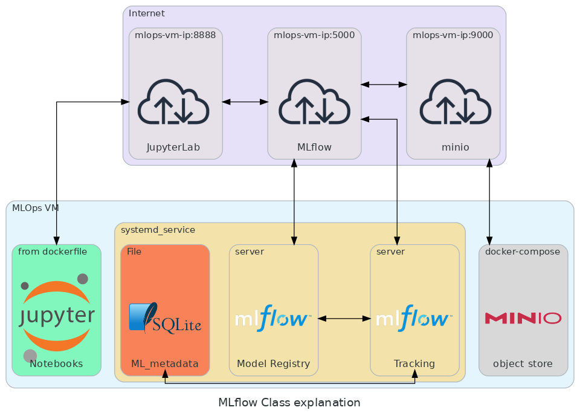

# mlflow 
MLflow es una plataforma de código abierto para administrar el ciclo de vida completo del aprendizaje automático. Tiene los siguientes componentes principales: Seguimiento: Permite realizar un seguimiento de los experimentos para registrar y comparar parámetros y resultados


Para el uso de esta plataforma partimos de una instancia de maquina virtual. Esta maquina soportara la plataforma y todos los componentes necesarios para su funcionamiento. En este repositorio encontrara una arquitectura de funcionamiento especifica y se le propondrán modificaciones para que se familiarice con la configuración de este tipo de sistemas, no solo con su uso.

Para soportar mlflow, en este caso se configurara un servicio usando `systemd` mediante un archivo de configuración `mlflow_serv.service` el cual contendrá todo lo necesario para el funcionamiento de la plataforma, sin embargo, existen componentes de registro adicionales que si bien, se enlazan a este sistema, son externos. Para los metadatos se usa el método mas sencillo posible usar una base de datos SQLite. Mientras que para los artefactos, se usara un bucket s3.

En este ejemplo se establecen 3 servicios dentro de la misma máquina virtual pero sin conexión entre ellos. El primero un contenedor mediante un dockerfile que disponibiliza un servicio de JupyerLab en donde se realizará la experimentación. El segundo un almacen de objetos, usando minio, mediante un docker-compose (estos dos conetenedores no tienen conexión por docker-network) y finalmente un servidor de mlflow, en el diagrama se hará enfasis en los componentes de model registry y server tracking que son servidores de servicio independientes, así como una base de datos sqlite representada en un archivo (este servicio es solo por practicidad en us esenario real se debe disponer una base de datos para este fin).

<span style="display:block;text-align:center"></span>

Esta configuración busca simular un escenario en la nube, en donde no tienen comunicación directa estos servicios, por lo tanto la comunicación se debe realizar mediante sus puertos expuestos a internet, uno por cada servicio. 

## Artefactos de mlflow usando minio

mlflow requiere almacenamiento de artefactos, para esto es necesario un sistema de almacenamiento de archivos, en este caso usaremos la configuración existente para los bucket s3. No es necesario usar los servicios de AWS, se usara la imagen de contenedor de **minio**, en este ejemplo se proporciona docker-compose.yaml para iniciar este contenedor. Utilice el siguiente comando para iniciar minio:

    docker compose up -d

Cuando este lista la instancia, ingrese al puerto 9001 de su maquina, ingrese usuario y contraseña descritos en el docker-compose.yaml. Dentro de esta herramienta cree un nuevo bucket este permitirá almacenar todos los artefactos de mlflow. Este servicio separa UI en puerto 9001 y API en 9000.

## Instalación de mlflow
la instalación de mlflow en este escenario requiere `awscli` y `boto3` para realizar la conexión al bucket de s3, en este caso configurado usando la imagen de minio.

```
pip install mlflow awscli boto3
```

## Start mlflow server

Una vez instalado mlflow, es cuestión de iniciar el servidor con la siguiente instrucción.

```bash
mlflow server \
--backend-store-uri sqlite:////home/estudiante/MLOPS_PUJ/Niveles/2/mlflow/mlflow.db \
--default-artifact-root s3://mlflows3/artifacts \
--host 0.0.0.0 \
--serve-artifacts
```

 En donde, `--backend-store-uri` nos permite definir el lugar de almacenamiento de los metadatos de mlflow, asi como sus referencias a artefactos, el parametro `sqlite:////home/profesor/MLOPS/MLOPS_PUJ/mlflow/mlflow.db` corresponde al la ubicación del la base de datos SQLite, en caso de usar una base de datos diferente se deben pasar las credenciales para su suo. 

Para el almacenamiento de artefactos usaremos el bucket de s3 instanciado anteriormente, indicandolo mediante `--default-artifact-root`, el parametro `s3://mlflows3/artifacts` indica que se realizara la conexión a un bucket de s3, el cual tiene por nombre **mlflows3** y se usara la carpeta **artifacts** para registro. Para garantizar la visibilidad de los artefactos se agrega `--serve-artifacts`. Por ultimo, para poder acceder a nuestra plataforma, especificamos `--host 0.0.0.0`, por defecto se asigna el puerto 5000.

Si se desea el mantener el sistema funcionando, se puede hacer mediante `systemd`, configurando un servicio de Linux.
Debe crear el servicio con el archivo mlflow_serv.service que contiene lo siguiente.

```ini
[Unit]
Description=MLflow tracking server
After=network.target 

[Service]
User=estudiante
Restart=on-failure
RestartSec=3
WorkingDirectory=/home/estudiante/MLOPS_PUJ/Niveles/2/mlflow/
Environment=MLFLOW_S3_ENDPOINT_URL=http://10.43.101.149:9000
Environment=AWS_ACCESS_KEY_ID=admin
Environment=AWS_SECRET_ACCESS_KEY=supersecret
ExecStart= python3 -m mlflow server \
--backend-store-uri sqlite:////home/estudiante/MLOPS_PUJ/Niveles/2/mlflow/mlflow.db \
--default-artifact-root s3://mlflows3/artifacts \
--host 0.0.0.0 \
--serve-artifacts

[Install]
WantedBy=multi-user.target
```

Las variables de entorno definidas, permiten: `MLFLOW_S3_ENDPOINT_URL` establecer conexion al bucket creado. `AWS_ACCESS_KEY_ID` asignar usuario de minio y `AWS_SECRET_ACCESS_KEY` la contrasena. Estas variables hacen referencia a servicios de AWS pues estan disenadas para esto, sin embargo, no usaremos mas que el api oficial boto3 para acceder.

## configuración systemd service
Una vez creado el archivo, habilite el servicio, lo primero es recargar los daemon antes de realizar un cambio ejecutando

```bash
sudo systemctl daemon-reload 
```

Ahora sí, habilite y valide el servicio

```bash
sudo systemctl enable /home/estudiante/MLOPS_PUJ/Niveles/2/mlflow/mlflow_serv.service
```

```bash
sudo systemctl start mlflow_serv.service 
```
Verifique que el servicio funciona adecuadamente

```bash
sudo systemctl status mlflow_serv.service 
```

## JupyterLab usando Dockerfile

Para aislar la ejecución de la plataforma, de la ejecución código de machine learning crearemos una imagen de contenedor y lo usaremos para desplegar Jupyter notebook que contiene ejemplos para el uso de mlflow. Para esto se definió un `Dockerfile` y un `requirements.txt`.

```bash
docker build -t jupyterlab .
```
```bash
docker run -it --name jupyterlab --rm -e TZ=America/Bogota -p 8888:8888 -v $PWD:/work jupyterlab:latest
```


