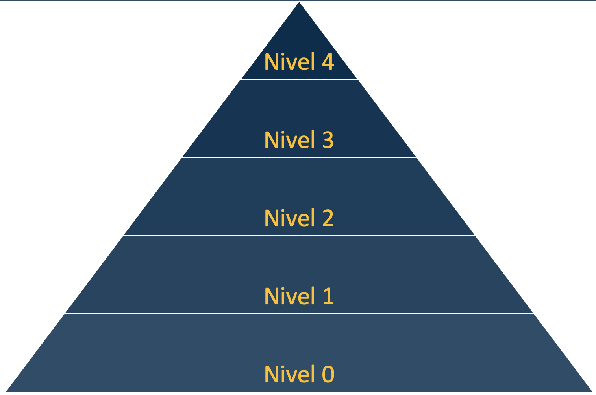
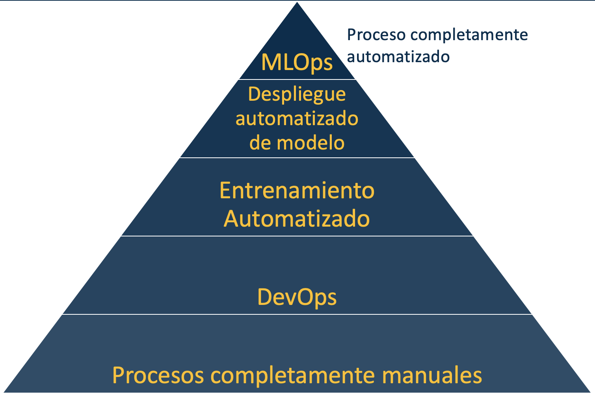

# Machine Learning Operations (MLOps)

### Operaciones de machine learning curso para Pontificia Universidad Javeriana Bogota
 ---

 Este repositorio busca brindar actividades y ejemplos sobre los distintos niveles de MLOps. El contenido se encuentra en constante cambio y actualización, si bien existen versiones previas el contenido cada semestre se limpia y actualiza, buscando mejorar la información, herramientas y contenido en general. Tambien es importante recordar que el contenido se agrega a medida que el curso avanza, por lo que si desea ver una versión anterior al final de este documento encontrará enlace a los commit finales.

 MLOps busca aplicar las mejores practicas del desarrollo de software en los procesos de ingenieria y ciencia de datos.

 Este curso se desarrolla a traves del concepto de los "niveles" de MLOps, si bien no existe una definición extricta sobre estos niveles, estos hacen referencia al nivel de madurez y automatización de los equipos de trabajo.

 Se establecen 5 niveles, numerados de 0 a 4, la siguiente imágen muestra un extracción de estos niveles en una piramide, pues cada uno de los niveles es soporte para el siguiente y se espera su implementación como punto de partida del siguiente nivel.

 

Cada unos de estos niveles se desarrollarán en las clases de este curso **Operaciones de Machine Learning** de la [Maestría en Inteligencia Artificial](https://www.javeriana.edu.co/maestria-inteligencia-artificial) de la [Pontificia Universidad Javeriana](https://www.javeriana.edu.co)

Los niveles de MLOps inician con un el nivel 0 el cual es un nivel de automatización cero, en donde el proceso de llevar a produccion un producto es completamente manual. El nivel 1 agrega practivas simples de devops al proceso, agregando versionamiento de codigo y de imagenes al proceso. El nivel 2 agrega entrenamiento automatizado al proceso. El nivel 3 ya permite un proceso de despliegue automático de las nuevas versiones del modelo. El  último nivel (4) es el proceso completamente automatizado, incluye datos, código, modelos e infraestructura. 

Cada uno de los niveles contiene información sobre procesos, herramientas/tecnologías así como ejemplos y actividades propuestas.

- [Nivel 0](niveles/0/readme.md)
- [Nivel 1](niveles/1/readme.md)
- [Nivel 2](niveles/2/readme.md)
- [Nivel 3](niveles/3/readme.md)
- [Nivel 4](niveles/4/readme.md)

Finalmente el acá se encuentra el [curso en su ultima versión](https://github.com/CristianDiazAlvarez/MLOPS_PUJ/tree/b14755b644dec27a50709844e356f2fce6e34644) del curso anterior. Recuerde que la estructura cambio completamente y actividades serán diferentes.